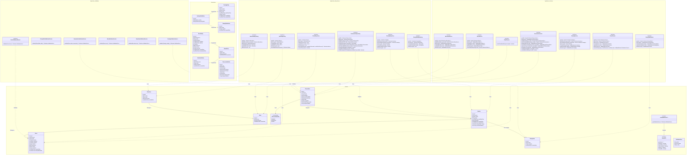

```mermaid
classDiagram
  %% Domain Layer: Entities and Value Objects
  namespace Domain {
    class Event {
      +Long id
      +Long menuId
      +String name
      +String description
      +LocalDate startDate
      +LocalDate endDate
      +Integer duration
      +BigDecimal price
      +boolean active
      +boolean archived
      +LocalDateTime createdDate
      +LocalDateTime lastUpdatedDate
    }

    class DiningTable {
      +Long id
      +String name
      +Integer capacity
      +LocalDateTime createdDate
    }

    class Seating {
      +Long id
      +Long eventId
      +boolean status
      +String name
      +LocalDateTime startDateTime
      +Integer duration
      +LocalDateTime createdDate
      +LocalDateTime updatedDate
      +Collection~DiningTable~ tables
      +Set~Long~ selectedTableIds
    }

    class Menu {
      +Long id
      +String name
      +String description
      +LocalDateTime createdDate
    }

    class MenuItem {
      +Long id
      +Menu menu
      +String name
      +String description
      +LocalDateTime createdDate
    }

    class Reservation {
      +long id
      +UUID uuid
      +Long eventId
      +Long seatingId
      +String guestFirstName
      +String guestLastName
      +String email
      +Integer groupSize
      +ReservationStatus status
      +Long assignedTableId
    }

    class ReservationStatus {
      <<enumeration>>
      PENDING
      APPROVED
      DENIED
    }

    class Result~T~ {
      <<interface>>
      +getValue() T
      +isEmpty() boolean
      +hasValue() boolean
      +isSuccessful() boolean
      +isError() boolean
      +isInvalid() boolean
    }

    class ValidatedResult~T~ {
      <<interface>>
      +getValidationErrors() Collection~ValidationError~
    }

    class ValidationError {
      +String field
      +String message
      +Object value
    }
  }

  %% Application Layer: Service Interfaces
  namespace Application_Services {

    class EventService {
      <<interface>>
      +getAll() Result~Collection~Event~~
      +getActive() Result~Collection~Event~~
      +get(Long id) ValidatedResult~Event~
      +create(Event event) ValidatedResult~Event~
      +update(Event event) ValidatedResult~Event~
      +delete(Long id) ValidatedResult~Event~
      +search(String query, LocalDate start, LocalDate end) ValidatedResult~Collection~Event~~
    }

    class DiningTableService {
      <<interface>>
      +getAll() Result~Collection~DiningTable~~
      +get(Long id) ValidatedResult~DiningTable~
      +create(DiningTable table) ValidatedResult~DiningTable~
      +update(DiningTable table) ValidatedResult~DiningTable~
      +delete(Long id) ValidatedResult~Void~
    }

    class SeatingService {
      <<interface>>
      +getAll() Result~Collection~Seating~~
      +getByEvent(Long eventId) Result~Collection~Seating~~
      +getSeatingsByTableId(Long tableId) Result~Collection~Seating~~
      +get(Long id) Result~Seating~
      +create(Seating seating) ValidatedResult~Seating~
      +update(Seating seating) ValidatedResult~Seating~
      +delete(Long id) ValidatedResult~Seating~
    }

    class MenuService {
      <<interface>>
      +getAll() Result~Collection~Menu~~
      +get(Long id) ValidatedResult~Menu~
      +create(Menu menu) ValidatedResult~Menu~
      +update(Menu menu) ValidatedResult~Menu~
      +delete(Long id) ValidatedResult~Void~
      +searchByName(String name) Result~Collection~Menu~~
    }

    class MenuItemService {
      <<interface>>
      +getAll() Result~Collection~MenuItem~~
      +getByMenuId(Long menuId) Result~Collection~MenuItem~~
      +get(Long id) ValidatedResult~MenuItem~
      +create(MenuItem item) ValidatedResult~MenuItem~
      +update(MenuItem item) ValidatedResult~MenuItem~
      +delete(Long id) ValidatedResult~Void~
    }

    class ReservationService {
      <<interface>>
      +getAll() Result~Collection~Reservation~~
      +get(long id) ValidatedResult~Reservation~
      +getByEvent(long eventId) Result~Collection~Reservation~~
      +getConfirmedByEvent(long eventId) Result~Collection~Reservation~~
      +getByUuid(UUID uuid) ValidatedResult~Reservation~
      +requestReservation(Reservation reservation) ValidatedResult~Reservation~
      +approve(long reservationId, long tableId) ValidatedResult~Reservation~
      +deny(long reservationId) ValidatedResult~Reservation~
      +existsBySeatingId(long seatingId) boolean
      +existsByEventId(long eventId) boolean
    }

    class EmailService {
      <<interface>>
      +sendEmail(EmailRequest request) boolean
    }
  }

  %% Application Layer: Validation Services
  namespace Application_Validation {

    class EventValidationService {
      <<interface>>
      +validate(Event event) Collection~ValidationError~
    }

    class DiningTableValidationService {
      +validate(DiningTable table) Collection~ValidationError~
    }

    class SeatingValidationService {
      +validate(Seating seating) Collection~ValidationError~
    }

    class MenuValidationService {
      +validate(Menu menu) Collection~ValidationError~
    }

    class MenuItemValidationService {
      +validate(MenuItem item) Collection~ValidationError~
    }

    class ReservationValidationService {
      +validate(Reservation reservation) Collection~ValidationError~
    }
  }

  %% Application Layer: Repository Interfaces
  namespace Application_Repositories {

    class EventRepository {
      <<interface>>
      +getAll() Collection~Event~
      +get(Long id) Optional~Event~
      +create(Event event) Event
      +update(Event event) Event
      +delete(Long id) void
      +search(String name, LocalDateTime start, LocalDateTime end) Collection~Event~
      +exists(String name) boolean
    }

    class DiningTableRepository {
      <<interface>>
      +getAll() Collection~DiningTable~
      +get(Long id) Optional~DiningTable~
      +create(DiningTable table) DiningTable
      +update(DiningTable table) DiningTable
      +delete(Long id) void
    }

    class SeatingRepository {
      <<interface>>
      +getAll() Collection~Seating~
      +getByEvent(Long eventId) Collection~Seating~
      +getSeatingsByTableId(Long tableId) Collection~Seating~
      +get(Long id) Optional~Seating~
      +create(Seating seating) Seating
      +update(Seating seating) Seating
      +delete(Long id) void
    }

    class MenuRepository {
      <<interface>>
      +getAll() Collection~Menu~
      +get(Long id) Optional~Menu~
      +create(Menu menu) Menu
      +update(Menu menu) Menu
      +delete(Long id) void
      +searchByName(String name) Collection~Menu~
    }

    class MenuItemRepository {
      <<interface>>
      +getAll() Collection~MenuItem~
      +getByMenuId(Long menuId) Collection~MenuItem~
      +get(Long id) Optional~MenuItem~
      +create(MenuItem item) MenuItem
      +update(MenuItem item) MenuItem
      +delete(Long id) void
    }

    class ReservationRepository {
      <<interface>>
      +getAll() Collection~Reservation~
      +get(long id) Optional~Reservation~
      +getByEvent(long eventId) Collection~Reservation~
      +getByUuid(UUID uuid) Optional~Reservation~
      +create(Reservation reservation) Reservation
      +updateStatus(long id, ReservationStatus status, Long tableId) Reservation
      +getConfirmedByEvent(long eventId) Collection~Reservation~
      +existsBySeatingId(long seatingId) boolean
      +existsByEventId(long eventId) boolean
      +isTableAssignedForSeating(long seatingId, long tableId) boolean
    }
  }

  %% Persistence Layer: Database Entities
  namespace Persistence {
    class EventEntity {
      +Long id
      +MenuEntity menu
      +String name
      +String description
      +LocalDateTime startDate
      +LocalDateTime endDate
      +int duration
      +BigDecimal price
      +boolean active
      +boolean archived
      +LocalDateTime createdDate
      +LocalDateTime lastUpdatedDate
    }

    class DiningTableEntity {
      +Long id
      +String name
      +Integer capacity
      +LocalDateTime createdDate
    }

    class SeatingEntity {
      +Long id
      +Long eventId
      +boolean status
      +String name
      +LocalDateTime startDateTime
      +Integer duration
      +LocalDateTime createdDate
      +LocalDateTime updatedDate
    }

    class SeatingTableEntity {
      +Long id
      +SeatingEntity seating
      +DiningTableEntity diningTable
    }

    class MenuEntity {
      +Long id
      +String name
      +String description
      +LocalDateTime createdDate
    }

    class MenuItemEntity {
      +Long id
      +MenuEntity menu
      +String name
      +String description
      +LocalDateTime createdDate
    }

    class ReservationEntity {
      +long id
      +UUID uuid
      +long eventId
      +long seatingId
      +String guestFirstName
      +String guestLastName
      +String email
      +int groupSize
      +ReservationStatus status
      +Long assignedTableId
    }
  }

  %% Relationships
  EventService ..> Event : Uses
  DiningTableService ..> DiningTable : Uses
  SeatingService ..> Seating : Uses
  MenuService ..> Menu : Uses
  MenuItemService ..> MenuItem : Uses
  ReservationService ..> Reservation : Uses

  EventRepository ..> Event : Uses
  DiningTableRepository ..> DiningTable : Uses
  SeatingRepository ..> Seating : Uses
  MenuRepository ..> Menu : Uses
  MenuItemRepository ..> MenuItem : Uses
  ReservationRepository ..> Reservation : Uses

  EventValidationService ..> Event : Validates
  ReservationValidationService ..> Reservation : Validates
  SeatingValidationService ..> Seating : Validates

  EmailService ..> Reservation : Uses

  ValidatedResult --|> Result : Extends

  Seating --> DiningTable : Has available
  Seating --> Event : Belongs to
  MenuItem --> Menu : Belongs to
  Reservation --> Seating : Requests
  Reservation --> ReservationStatus : Uses

  SeatingTableEntity --> SeatingEntity : ManyToOne
  SeatingTableEntity --> DiningTableEntity : ManyToOne
  EventEntity --> MenuEntity : ManyToOne
  MenuItemEntity --> MenuEntity : ManyToOne
```
